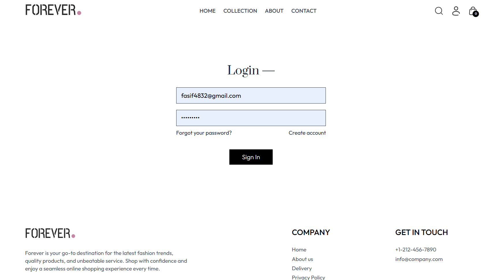
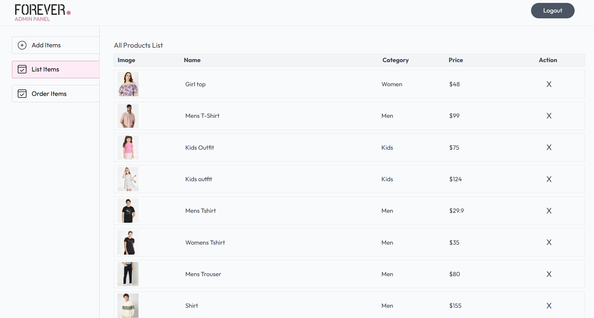

<a name="top"></a>
<h1 align="center">Forever - MERN Stack E-commerce Platform 📦</h1>


## This is how the project looks like:

<table>
  <tr>
    <td>
      <a href='./preview/login.png'></a>
    </td>
    <td>
      <a href='./preview/collection.png'></a>
    </td>
    <td>
      <a href='./preview/admin.png'></a>
    </td>
  </tr>
</table>

## About This Project:


⚛️ Tech Stack: <kbd>[React.js](https://react.dev/learn/installation)</kbd>, <kbd>[Node.js](https://nodejs.org/en/download/package-manager)</kbd>, <kbd>[Express.js](https://expressjs.com)</kbd>, <kbd>[MongoDB](https://www.mongodb.com)</kbd>, <kbd>[Tailwind CSS](https://tailwindcss.com/docs/installation)</kbd>

### 🔧 Backend 
- 🗄️ MongoDB Setup
- 🔐 Authentication with JWT (User & Admin)
- 🔒 Protected Routes (User & Admin)
- 📦 Product, Cart, and Order Management APIs
- 🛒 Cart and Checkout Logic
- ☁️ Image Uploads (Cloudinary)
- 🧾 Admin Dashboard APIs

### 🌐 Frontend
- 📋 Signup Page UI
- 🔓 Login Page UI
- 📤 Implementing Signup
- 🔑 Implementing Login
- 🛍️ Product Listing, Search, and Details
- 🛒 Cart and Checkout UI
- 🔑 User Authentication (Login/Register)
- 📦 Order Placement and History
- 📱 Responsive UI
- 🧑‍💼 Admin Panel (Separate)
- 💳 Payment Integration (Stripe/Razorpay)
- 🚀 And Many More Cool Features

<br/>

## System requirements

> [!NOTE]
> Before you start, make sure you have the following installed:
- [x] Node.js 20.12.0 or later installed.
- [x] React.js 18.3.1 or later.
- [x] Operating systems: macOS, Windows, or Linux.
- [x] VSCode or another text editor of your choice.

<br/>

## Code organization and folder structure

```
(Root)
├───backend               
│     ├───config
│     ├───controllers
│     ├───middleware
│     ├───models
│     ├───routes
│     ├───(server.js)
│     ├───(package.json)
│     └───(package-lock.json)
│
├───frontend               
│     ├───public
│     │    └─[[...assets]]
│     ├───src  
│     │     ├───components
│     │     ├───context
│     │     ├───pages
│     │     ├───assets
│     │     ├───(App.jsx)
│     │     ├───(main.jsx)
│     │     └───(index.css)
│     │
│     ├───(index.html)
│     ├───(eslint.config.js)
│     ├───(tailwind.config.js)
│     ├───(package.json)
│     └───(package-lock.json)
│
├───admin
│     ├───public
│     ├───src
│     │     ├───components
│     │     ├───pages
│     │     ├───assets
│     │     ├───(App.jsx)
│     │     ├───(main.jsx)
│     │     └───(index.css)
│     ├───(index.html)
│     ├───(eslint.config.js)
│     ├───(tailwind.config.js)
│     ├───(package.json)
│     └───(package-lock.json)
│
├───preview
│     └───[[...screenshots]]
├───LICENSE
└───README.md
```

###  `public` **directory**

This folder serves static assets, like images, font files. 

###  `components` **directory**

This folder contains React components which are independent and reusable.

###  `context`  **directory**

This folder contains React context providers (e.g., for shop/cart state).

### `pages`  **directory**

This folder contains the main page components for routing (Home, Product, Cart, Orders, etc.).

###  `assets` **directory**

This folder contains static images and icons used in the app.

### `index.css` **file**

This is the main CSS file of the application. You can use this file to add CSS rules to all the routes in your application - such as CSS reset rules, site-wide styles for HTML elements like links, and more.

<br/>

## 🚀 Quick Start Guide

To spin up this project locally, follow these steps

### Clone

Use the ` git clone ` CLI to clone this repository directly to your machine

### Run project on local

```bash
# Install dependencies for all workspaces
cd backend && npm install
cd ../frontend && npm install
cd ../admin && npm install
cd ..
```

### Start the development servers

Open three terminals (or use a process manager):

```bash
# Terminal 1: Backend
cd backend
npm run dev

# Terminal 2: Frontend
cd ../frontend
npm run dev

# Terminal 3: Admin
cd ../admin
npm run dev
```

## Project Dev Steps

1. Environment Setup
   
   Create a `.env` file in the `backend` directory
   PUT THIS INSIDE

```bash
# Node server
SERVER_PORT=4000
NODE_ENV=development

# Client config
CLIENT_HOST=localhost
CLIENT_PORT=5173
CLIENT_URL=http://localhost:5173

# JWT secret
JWT_SECRET=your_jwt_secret

# Database integration
MONGO_URI=your_mongodb_uri

# Cloudinary
CLOUDINARY_CLOUD_NAME=your_cloud_name
CLOUDINARY_API_KEY=your_api_key
CLOUDINARY_API_SECRET=your_api_secret

# Stripe/Razorpay (if used)
STRIPE_SECRET_KEY=your_stripe_secret
RAZORPAY_KEY_ID=your_razorpay_key_id
RAZORPAY_KEY_SECRET=your_razorpay_key_secret
```

2.  Project Folders & Files Structure

3.  Update `package.json` scripts in each workspace as needed. Example for Windows users:

```json
// In backend/package.json
"scripts": {
  "dev": "nodemon server.js"
}
// In frontend/package.json and admin/package.json
"scripts": {
  "dev": "vite"
}
```

4.  Setup Eslint & Prettier
   
5.  Run project in development

```bash
# See above for running each workspace
```

> [!TIP]
> Run this command to format code before running `git commit` command.

```bash
npm run format
```

### Happy Coding!

<br>

[Back to top](#top)
